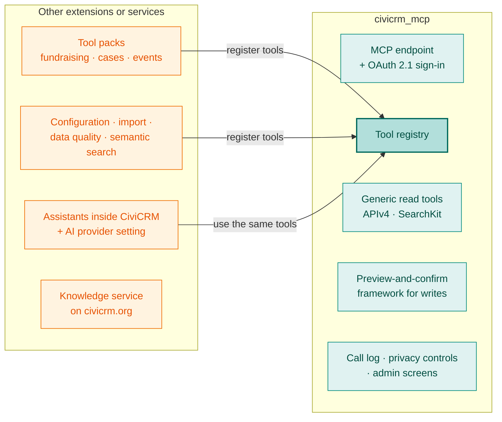

# Where civicrm_mcp fits

[civicrm_mcp](https://lab.civicrm.org/extensions/civicrm_mcp) is a CiviCRM extension that lets an organisation's own AI assistant work with CiviCRM safely, through MCP. Among the [proposed building blocks](path-forward.md) it is the **MCP gateway**, and it hosts the **shared tool registry**. This page sets out what it takes on, now and later, and what belongs elsewhere.

!!! note "Today's scope is set by the extension itself"
    The extension's own [Scope and non-goals](https://lab.civicrm.org/extensions/civicrm_mcp/-/blob/main/docs/scope.md) page is authoritative for what it does now. This page describes the longer-term picture and how it connects to the rest of these notes.

## In scope

| Area | Today | Later (proposed) | Capability |
|---|---|---|---|
| **MCP endpoint and sign-in** | Inside CiviCRM, OAuth 2.1, WordPress sites | More CMSs (Drupal, Backdrop, Standalone) and more AI clients | [C1](capabilities.md) |
| **Acting as the signed-in person** | Every call runs with their permissions | — | C1 |
| **Generic read tools** | APIv4 and SearchKit, read-only | Smaller, better-described tools that use fewer tokens | [C2](capabilities.md) |
| **Tool registry** | Other extensions add tools through an event | The same registry used by assistants inside CiviCRM, not only by MCP | [C3](capabilities.md) |
| **Changes** | None: read-only | A **preview-and-confirm framework** every write tool uses, opt-in per site | [C4](capabilities.md) |
| **Privacy controls** | Permissions, ACLs, row limits | Per-person profiles; "safe for AI" fields that also limit filtering | [C14](capabilities.md) |
| **Call log** | One row per call, refused calls included | — | C1 |
| **Administration** | Allowlist, limits, revoke all tokens | Admin screens, so no command line is needed | — |
| **Expert hand-off** | — | A standard way for any tool to say "this needs an implementer" | [C11](capabilities.md) |

## Out of scope, and where it belongs instead

| Not in civicrm_mcp | Why | Where it could live |
|---|---|---|
| **Domain tool packs** (fundraising, cases, events, volunteers) | Need domain experts and their own pace | Separate extensions that register tools |
| **Configuration, starter kits, import, data quality, semantic search** | Each is a substantial product of its own | Separate extensions using the registry and the preview framework |
| **A chat interface or assistant inside CiviCRM** | civicrm_mcp supplies tools and data; the conversation happens in the AI client | A separate in-app assistant extension, using the same registry |
| **Running, choosing or paying for an AI model** | Bring your own model | The organisation's own AI service, or an AI provider setting extension |
| **API-key access for outside servers** | Other MCP servers already offer it; civicrm_mcp is the signed-in, per-person option | Existing external MCP servers ([related work](related-work.md)) |
| **A blanket permission bypass** | The design rests on the AI acting as the person asking | — (narrow, reviewable exceptions only) |
| **Long-running background AI work** | PHP's request cycle can't host long agent loops | An external worker ([C12](capabilities.md)) |
| **Help before CiviCRM is installed** | There is no site yet | A knowledge service on civicrm.org ([C10](capabilities.md)) |

## Open questions

- Should the tool registry eventually move out of civicrm_mcp, into its own extension or into core ("core when ready"), once assistants inside CiviCRM use it too?
- Which write tools come first, once the preview framework exists?
- Should "safe for AI" field markings be a CiviCRM-wide setting that every AI extension honours, rather than civicrm_mcp's alone?

Comments below, or as issues on the [civicrm_mcp project](https://lab.civicrm.org/extensions/civicrm_mcp/-/issues).
