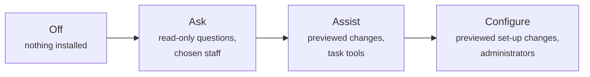

# Already on CiviCRM

You already have CiviCRM, your data, your configuration and probably an implementer you trust. Here is what AI could add, and what stays the same.

## What never changes

- **If you don't install an AI extension, nothing changes.** No AI features appear, and no data goes anywhere new.
- **Your permissions still rule.** An assistant sees only what the signed-in person could already see in CiviCRM.
- **Your implementer stays your implementer.** AI tools are built to recognise when something needs expert help and to say so.

## What you could do

| Who | Starting out: read-only questions | Later: tool packs and previewed changes |
|---|---|---|
| **Executive director** | "How many donors gave this year compared with last year?" | Board-ready summaries; "what should I keep an eye on this quarter?" |
| **Fundraiser** | "Show me donors over $500 who haven't given in 18 months" | A briefing before a donor meeting; thank-you notes logged as activities, previewed first |
| **Programme staff** | "What's open on my cases?" | Case summaries; follow-ups logged for you |
| **Volunteer coordinator** | Permission-scoped lists | Matching volunteers to opportunities |
| **CiviCRM administrator** | "Which custom fields exist on Contribution?" | "Add a dietary-needs field to event registration", previewed; duplicate clean-up; "why didn't this receipt send?" |

## Choosing your level

| Level | Good for |
|---|---|
| **Off** | Organisations with no-AI policies |
| **Ask** | Most organisations starting out |
| **Assist** | Teams comfortable with Ask |
| **Configure** | Organisations without a full-time administrator, ideally with an implementer reviewing |

## What you need

1. **An AI assistant that supports MCP** (Model Context Protocol, the open standard for connecting assistants to systems), such as Claude or ChatGPT; or, for AI inside CiviCRM, an API key from the provider you choose.
2. **The relevant extensions**, installed and configured by an administrator.
3. **A decision about data**: which AI services may see your CiviCRM data, and under what terms. An AI-use policy helps. If no outside service is acceptable, a locally run model is an option.

## Where experts come in

AI makes CiviCRM easier to operate, but it doesn't replace design judgement. Payment processors, receipting rules, data migrations, integrations and anything touching compliance are jobs for an implementer. The tools should say so, and point you to the [partner directory](https://civicrm.com/partners/).
