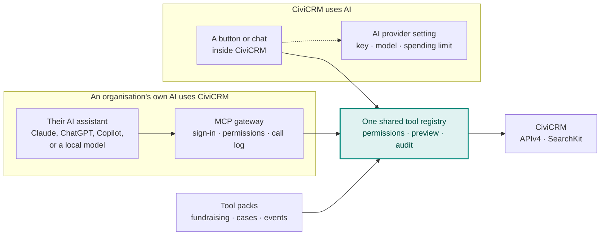

# Adding AI to CiviCRM

<strong>How CiviCRM can add AI capabilities safely and sustainably, building on what WordPress and Drupal have already learned.</strong>

!!! info "A discussion draft"
    These pages are a starting point for a community conversation, not a statement of CiviCRM's direction, which belongs to the Core Team and the community. Every page has a comment box at the bottom. Corrections, objections and better ideas are all welcome.

## In brief

- **There are two ways to bring AI in**, and both are useful: an organisation's own AI assistant working *with* CiviCRM, and CiviCRM calling an AI model *itself*. [More](two-directions.md)
- **WordPress and Drupal have both done both**, and they've settled on similar patterns: shared foundations first, features optional, one registry of capabilities serving both directions. [More](wordpress-and-drupal.md)
- **CiviCRM can apply the same patterns** as a small set of building blocks, delivered as extensions first: one tool registry, a secure connection for outside assistants, one AI provider setting, and shared safety rules. [More](path-forward.md)
- **AI stays optional, and organisations bring their own model.** CiviCRM never picks an AI vendor or pays for anyone's AI, and a site that wants no AI changes nothing.

## How the pieces fit

Click any box to read more.

## Explore

-   :material-swap-horizontal:{ .lg .middle } **[Two ways to bring AI in](two-directions.md)**

    ---

    An organisation's own AI using CiviCRM, and CiviCRM using AI. Different people, different strengths.

-   :material-handshake-outline:{ .lg .middle } **[Lessons from WordPress and Drupal](wordpress-and-drupal.md)**

    ---

    What both projects built, the patterns they share, and the PHP libraries CiviCRM can reuse.

-   :material-layers-triple-outline:{ .lg .middle } **[Proposed building blocks](path-forward.md)**

    ---

    One tool registry for both directions, CMS-neutral foundations, shared safety rules, and how to organise the work.

-   :material-puzzle-outline:{ .lg .middle } **[What AI could do in CiviCRM](capabilities.md)**

    ---

    Fifteen capabilities, and the extensions that could provide them.

-   :material-account-group-outline:{ .lg .middle } **[For organisations](existing-users.md)**

    ---

    What changes, and what never does, [for current users](existing-users.md) and [for organisations choosing a CRM](new-organisations.md).

-   :material-shield-check-outline:{ .lg .middle } **[Principles](why.md)**

    ---

    Optional always, bring your own model, the AI acts as you, preview before change.

