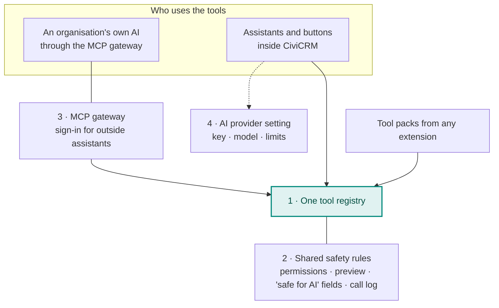
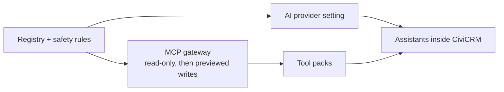

# Proposed building blocks

Applying the [lessons from WordPress and Drupal](wordpress-and-drupal.md) to CiviCRM, at the scale of a project built by partners and volunteers.

## One tool registry, used in both directions

A tool such as "find my open cases" or "draft a SearchKit search" is registered **once**, with:

- a description of its inputs and outputs;
- a permission check that runs as the signed-in person;
- a row in a call log;
- for anything that changes data, a **preview the person confirms** before it's saved;
- a flag saying whether it's offered to AI at all (private by default).

Outside assistants reach the registry through the MCP gateway, and assistants inside CiviCRM use the same tools directly. Tool packs from any extension register into the same place and work in both directions with no extra effort. CiviCRM already has much of the raw material: APIv4 describes every entity and enforces permissions, and SearchKit displays can become tools without code.

## Shared safety rules

The same rules apply whichever direction a request comes from:

- **Every call runs as the signed-in person**, with their permissions; never a hidden service account.
- **Changes are previewed and confirmed.**
- **A "safe for AI" marker on fields** keeps chosen data, such as health or giving details, away from every AI tool. It must also restrict what can be *filtered* on, not only what is returned; otherwise a model can learn a hidden value by asking "how many contacts have a last name starting with Sm?".
- **Every call is logged**, including refused ones.
- **Tools say plainly when a job needs an implementer**, and point to the [partner directory](https://civicrm.com/partners/).

## The MCP gateway

The connection for outside assistants: the MCP endpoint, sign-in with OAuth 2.1 so people use their normal CiviCRM login, and per-person access. The [official MCP PHP SDK](https://github.com/modelcontextprotocol/php-sdk) handles the protocol, as it does for Drupal. Sign-in tokens must work only for MCP, never the rest of CiviCRM's API, and expire quickly. [civicrm_mcp](civicrm-mcp-scope.md) is the extension taking this on.

## An AI provider setting

For features where CiviCRM calls a model itself: one place for the provider, model, key and limits, used by every extension that needs it, built on [Symfony AI](https://github.com/symfony/ai) so it works the same on every CMS.

- **Keys outside the database where possible** (an environment variable or settings file first, as WordPress does), and encrypted when stored; CiviCRM already has credential encryption.
- **Spending limits** per site and per user, as Drupal's AI Metering does.
- **A log of every AI call**, like the gateway's call log.
- Later, optional adapters could reuse a key already entered in WordPress's Connectors screen or Drupal's Key module, so a site doesn't enter it twice.

## Order of work

Connecting outside assistants comes first because it needs no AI vendor, key or bill inside CiviCRM. Assistants inside CiviCRM follow, reusing the same tools. Every piece starts as an extension: **"extensions first, core when ready"**.

## How the work could be organised

- **A short public list of the building blocks**, each with an owner, so efforts join up rather than overlap.
- **Two areas with named people**, as Drupal does: outside assistants, and AI inside CiviCRM.
- **Linked to, but separate from,** the community's [discussion of an AI contribution policy](https://lab.civicrm.org/dev/core/-/work_items/6796), which is about how code is written rather than what the product does.
- **No single organisation owns AI for CiviCRM**, a principle partners have already stated.

## Questions for discussion

- Is a shared tool registry the right centre of gravity?
- Which building blocks would you, or your organisation, want to help with?
- What's missing?
