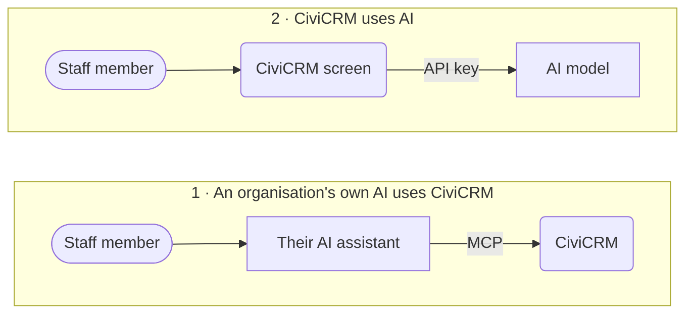
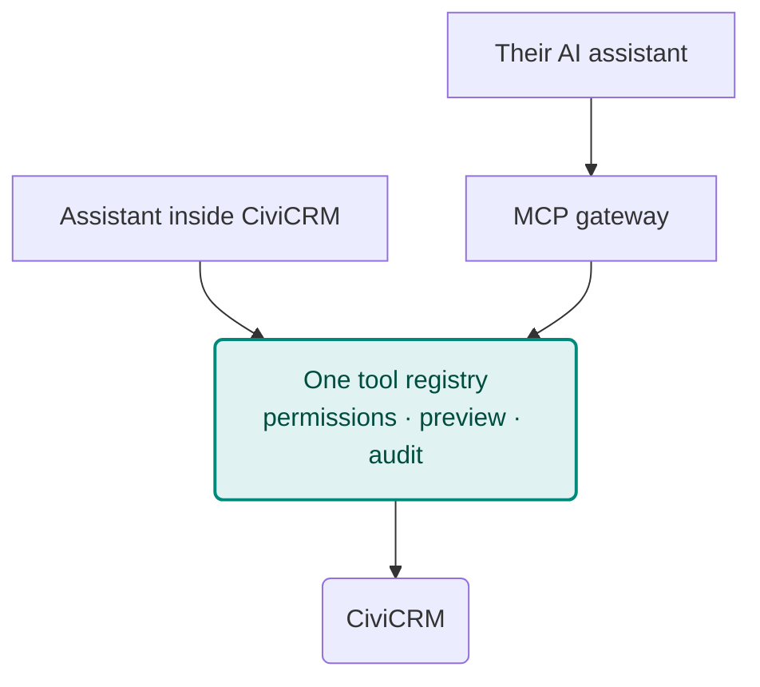

# Two ways to bring AI in

There are two quite different ways to bring AI and a CRM together. Drupal's AI Initiative calls them **"outside AI"** and **"inside AI"** and runs them as two workstreams; WordPress supports both through one shared registry. [Lessons from both](wordpress-and-drupal.md).

=== "1 · Their AI uses CiviCRM"

    - **What happens:** someone asks their own assistant (Claude, ChatGPT, Copilot or a local model) a question, and the assistant uses CiviCRM's tools to answer it.
    - **Who chooses and pays for the model:** the person or organisation, on the plan they already have.
    - **What CiviCRM provides:** a safe connection: sign-in, permissions, a call log and good tools. The open standard for this is **MCP** (Model Context Protocol).
    - **Strengths:** no AI vendor, key or bill inside CiviCRM; works with the assistant staff already use; the assistant can combine CiviCRM with email, documents and other systems.
    - **To manage:** data travels to the person's AI service, so the organisation decides which services are acceptable, and the tools must be safe for any model.

=== "2 · CiviCRM uses AI"

    - **What happens:** someone clicks a button or opens a chat inside CiviCRM, and CiviCRM sends a prompt to an AI provider.
    - **Who chooses and pays for the model:** the site, through an API key stored in CiviCRM and billed per use.
    - **What CiviCRM provides:** an AI provider setting (keys, model choice, spending limits) plus the screens and automations that use it.
    - **Strengths:** works for staff with no AI subscription; AI can be built into particular screens and workflows, such as summaries and auto-filled fields.
    - **To manage:** the site holds keys and pays the bills, and long-running AI tasks need help from outside PHP's request cycle.

## Why both

They serve different people. A development director with an AI subscription wants *their* assistant to see CiviCRM alongside their email and documents. A front-desk volunteer with no AI account wants a "summarise this contact" button. Neither replaces the other.

## What they should share

Both directions need the same **tools**: "find my open cases", "draft a search", "log this activity". Built separately, there would be two sets of permission checks, two audit trails and two ways of previewing changes. WordPress solved this with one registry that both directions use, and [the proposal](path-forward.md) applies the same idea to CiviCRM:

