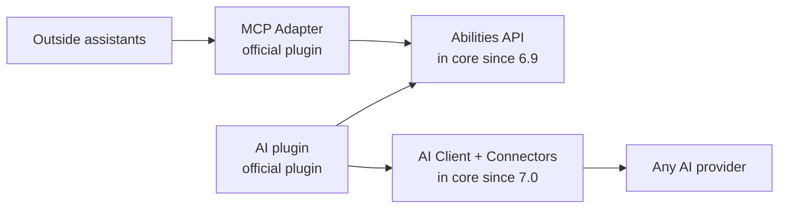
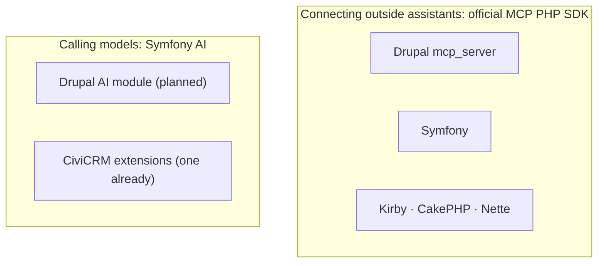

# Lessons from WordPress and Drupal

CiviCRM runs inside WordPress and Drupal for most of its users, and both projects have done a great deal of AI work since mid-2025. Their designs are public, and they've arrived at similar answers. State as of October 2026; corrections welcome.

## Six lessons

-   :material-numeric-1-circle-outline: **Support both directions**

    Both let outside assistants work with the site *and* let the site call AI itself. Neither chose one. [Two ways to bring AI in](two-directions.md)

-   :material-numeric-2-circle-outline: **One registry, two directions**

    WordPress writes each capability once (the Abilities API) and offers it both to outside assistants and to its own AI features.

-   :material-numeric-3-circle-outline: **Foundations first, features optional**

    Both put the plumbing (registry, AI client, key storage) in the core product and leave features in plugins or modules a site opts into.

-   :material-numeric-4-circle-outline: **Settle before core**

    WordPress's rule: "canonical first, core when ready". Its MCP adapter stays a plugin "while MCP is still changing".

-   :material-numeric-5-circle-outline: **Keys and costs need care**

    WordPress is adding a secrets store because keys sat unencrypted; Drupal added per-user spending limits and a log of every AI call.

-   :material-numeric-6-circle-outline: **Organise in public, with owners**

    WordPress has a named AI team and weekly summaries; Drupal runs "inside AI" and "outside AI" as two workstreams with named leads.

## WordPress: foundations in core, features in plugins

In July 2025 the WordPress AI team announced four ["AI Building Blocks"](https://make.wordpress.org/ai/2025/07/17/ai-building-blocks/). Most have now shipped:

| Building block | What it is | Status |
|---|---|---|
| **Abilities API** | One registry of everything the site can do, each with input and output schemas and a permission check | [In core since 6.9](https://make.wordpress.org/core/2025/11/10/abilities-api-in-wordpress-6-9/) (Dec 2025); refined in 7.1 with a single "public" exposure flag |
| **AI Client** | A provider-neutral way for WordPress code to call any model ([php-ai-client](https://github.com/WordPress/php-ai-client)) | [In core since 7.0](https://make.wordpress.org/core/2026/03/24/introducing-the-ai-client-in-wordpress-7-0/) (May 2026) |
| **Connectors** | A settings screen where the site owner enters an AI provider key | [In core since 7.0](https://make.wordpress.org/core/2026/03/18/introducing-the-connectors-api-in-wordpress-7-0/); keys read from an environment variable, a PHP constant or the database; a secrets store is planned for 7.2 |
| **MCP Adapter** | Offers selected abilities to outside AI assistants as MCP tools | [Official plugin](https://wordpress.org/plugins/mcp-adapter/), v0.7; signs in as a WordPress user |
| **AI plugin** | Features that call a model: titles, excerpts, alt text, translation, moderation | [Official plugin](https://wordpress.org/plugins/ai/), v1.4; a site agent and content assistant are planned |

Also worth noting:

- **Nothing happens until the owner opts in**: no AI call until a provider is set up, and no MCP until the adapter is installed. Abilities are private unless marked public.
- **Contribution guidelines** ask contributors to take responsibility for, and disclose, AI-assisted work ([AI guidelines](https://make.wordpress.org/ai/handbook/ai-guidelines/)).
- **Personal data is called out plainly.** WooCommerce's MCP documentation [warns](https://developer.woocommerce.com/docs/features/mcp/) that its order tools expose customers' personal data.

## Drupal: a funded initiative with two workstreams

- **The [AI module](https://www.drupal.org/project/ai)** (about 23,000 sites) provides one provider layer for dozens of AI services, with keys held in Drupal's Key module; field automators; an agent builder; chatbots; AI steps in ECA, Drupal's visual workflow tool; guardrails; logging of prompts and responses; and **AI Metering**, which sets token and cost quotas per user, with fallback to a local model.
- **The [Drupal AI Initiative](https://new.drupal.org/ai/announcement)** (launched June 2025) is supported by around 34 partner organisations. Since June 2026 it runs [two workstreams with named leads](https://dri.es/node/6246): **"Inside AI"** (Drupal uses AI) and **"Outside AI"** (an agent uses Drupal). Its [2026 roadmap](https://dri.es/node/6096) includes governance features such as batch approvals and audit trails.
- **Drupal CMS 2.0** (January 2026) makes AI optional: with a key, editors get prompt-to-page building, alt text and an admin chatbot, always with a person reviewing.
- **MCP:** [mcp_server](https://www.drupal.org/project/mcp_server) (beta) lets outside assistants use Drupal under the signed-in user's permissions, with optional OAuth 2.1 and per-tool scopes. It's built on the official MCP PHP SDK. A client module lets Drupal's own agents call other MCP servers.
- **Privacy:** hosted options such as amazee.ai let a site choose the region its model runs in, and Drupal presents its existing permissions, revisions and moderation as the governance layer for AI.

## Shared PHP foundations CiviCRM can reuse

- **The [official MCP PHP SDK](https://github.com/modelcontextprotocol/php-sdk)**, built with the PHP Foundation and Symfony, is becoming the common way to serve MCP from PHP. It checks sign-in tokens but deliberately leaves *issuing* them to each project, so each still provides its own sign-in.
- **[Symfony AI](https://github.com/symfony/ai)** (pre-1.0, released monthly) is gaining ground for calling models: Drupal's AI module plans to adopt it.
- **WordPress uses its own** AI client and MCP adapter. Its client is framework-neutral in principle but, so far, used only within WordPress.

Because CiviCRM runs on WordPress, Drupal, Backdrop, Joomla and Standalone, the CMS-neutral libraries are the natural base: a site gets the same AI capabilities whichever CMS it uses. [The proposal](path-forward.md) builds on them.

*Sources: make.wordpress.org, wordpress.org, drupal.org, dri.es, GitHub and Packagist, read October 2026. WordPress 7.0 and 7.1 release dates partly rely on news coverage, and Drupal partner numbers on The DropTimes.*
